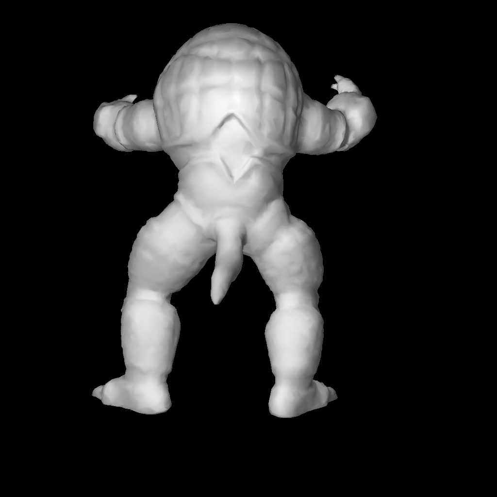

# What am I doing?
The goal is to read a tet mesh from the vtk file
It includes three steps:
1. parse the vtk file(from .vtk to numpy array)
2. extract the surface and remove the interior faces
3. show them in taichi GUI

# How to run it
install taichi>=1.0.4
```
    python main.py
```

the result should looks like this:


Hold the right mouse to move the view. Use "w/a/s/d" to move around.